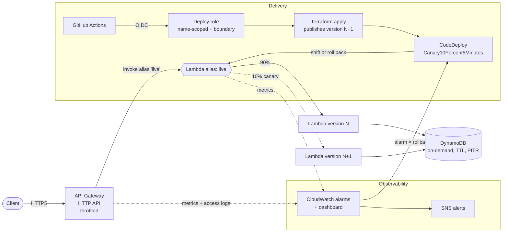

# Serverless URL Shortener on AWS

A small URL shortener used as a vehicle for production-style AWS delivery:
infrastructure as code, keyless CI/CD, canary releases with automatic
rollback, monitoring and least-privilege IAM. The application is deliberately
simple so the focus stays on how it is built, shipped and operated.

Default region: `ap-east-1` (Hong Kong).

## Architecture



| Path | Contents |
| --- | --- |
| `app/` | Python 3.13 Lambda handler and pytest unit tests |
| `terraform/bootstrap/` | One-time account setup: state bucket, GitHub OIDC, deploy role, permissions boundary, budget |
| `terraform/app/` | The application stack: Lambda, alias, HTTP API, DynamoDB, alarms, dashboard, CodeDeploy |
| `scripts/deploy_lambda.sh` | Starts the CodeDeploy canary and fails the pipeline if it rolls back |
| `scripts/smoke_test.sh` | End-to-end checks against the deployed API |
| `scripts/tests/` | Tests for the deploy script using stubbed `aws`/`terraform`/`curl` |

## API

| Route | Behaviour |
| --- | --- |
| `GET /health` | `{"status": "ok", "version": "<lambda version>"}`; shows which version served the request during a canary |
| `POST /links` | Body `{"url": "https://...", "ttl_days": 30}` returns `201 {"code", "short_url"}` |
| `GET /{code}` | `301` redirect, or `404` when unknown or expired |

## Exam-domain mapping

| AWS DevOps Engineer Professional domain | Where it shows up |
| --- | --- |
| SDLC automation | `.github/workflows/iac.yml` tests and validates every change; `aws-deploy.yml` plans, applies, canaries and smoke-tests |
| Configuration management and IaC | Two Terraform stacks, remote state with S3 native locking, pinned providers via lock files |
| Resilient cloud solutions | Immutable Lambda versions behind an alias, blue/green traffic shifting, automatic rollback, DynamoDB PITR |
| Monitoring and logging | Structured JSON logs, X-Ray tracing, API access logs, four alarms, a CloudWatch dashboard |
| Incident and event response | Alarms and CodeDeploy deployment events publish to SNS; a failed canary rolls back without a human |
| Security and compliance | GitHub OIDC (no access keys), trust limited to one repository environment, name-scoped deploy role, permissions boundary, TLS-only encrypted state bucket |

## Design decisions

**Why CodeDeploy instead of letting Terraform move the alias?**
Terraform publishes a new version on every change but is told to ignore the
alias version (`lifecycle.ignore_changes`). CodeDeploy then shifts 10% of
traffic, waits five minutes while watching the `lambda-errors` and `api-5xx`
alarms, and either completes or moves traffic back. Releases become gradual and
reversible instead of all-at-once.

**Why does the handler let unexpected exceptions escape?**
Catching everything and returning HTTP 500 would make the Lambda `Errors`
metric stay at zero, so a broken canary would never trip the rollback alarm.
Validation problems return 4xx; genuine failures fail the invocation.

**Why check `expires_at` on read when DynamoDB TTL is enabled?**
TTL deletion is a background process that can lag by hours. TTL keeps the table
small; the read-time check gives correct behaviour.

**Why a conditional write?**
`attribute_not_exists(code)` turns a short-code collision into a retry instead
of silently overwriting another user's link.

**How is the pipeline kept from escalating its own privileges?**
The deploy role can only create roles named `infra-toolkit-links-*` and only if
they carry the `infra-toolkit-links-boundary` permissions boundary, which it is
explicitly denied from changing or removing. The deploy role itself is named
outside that prefix so it cannot rewrite its own trust policy. Only jobs in the
`aws-demo` GitHub environment of this repository can assume it.

**Why S3 native state locking?**
Terraform 1.11+ can lock with a lock file in the state bucket, which removes the
DynamoDB lock table that older setups needed.

**Why is the bootstrap stack's state local?**
It creates the state bucket, so it cannot store its state there on the first
run. After the first apply it can be migrated into the bucket (see below).

## Cost

Everything is serverless and on-demand, so an idle deployment costs close to
nothing: Lambda, API Gateway, DynamoDB and X-Ray stay within free-tier volumes
at demo traffic, the four alarms and one dashboard fit the CloudWatch free tier,
and the state bucket costs cents. A budget (US$5 by default) emails at 80%
forecast and 100% actual spend. There is no NAT gateway, load balancer or
always-on compute.

## Deploying

Prerequisites: Terraform >= 1.11, AWS CLI v2, `jq`, and an AWS account where
`ap-east-1` is enabled (Account > AWS Regions > Hong Kong > Enable). It is an
opt-in region, so it is disabled on new accounts.

1. **Bootstrap the account** (once, with your own admin credentials):

   ```bash
   cd aws/terraform/bootstrap
   cp terraform.tfvars.example terraform.tfvars   # set budget_alert_email
   terraform init
   terraform apply
   ```

2. **Configure GitHub**: create an environment named `aws-demo` (optionally with
   required reviewers) and add these environment variables from the outputs:

   | Variable | Value |
   | --- | --- |
   | `AWS_DEPLOY_ROLE_ARN` | `deploy_role_arn` output |
   | `TF_STATE_BUCKET` | `state_bucket` output |
   | `AWS_REGION` | `ap-east-1` |
   | `ALARM_EMAIL` | optional, receives alarm and deployment emails |

3. **Deploy**: Actions > Deploy AWS Demo > Run workflow > `deploy`. The first
   run creates the stack; later runs canary new code.

4. **Tear down**: run the same workflow with `destroy`. The bootstrap stack
   (state bucket, OIDC, role, budget) stays and costs nothing.

Optional: move the bootstrap state into the bucket it created by adding a
`backend "s3" {}` block to `bootstrap/versions.tf` and running
`terraform init -migrate-state -backend-config=...` with key
`bootstrap/terraform.tfstate`.

## Demonstrating an automatic rollback

1. Make `health()` in `app/handler.py` raise an exception and push.
2. Run the deploy workflow. `deploy_lambda.sh` sends traffic during the canary;
   about 10% of `/health` calls hit the new version and fail.
3. The `lambda-errors` alarm fires, CodeDeploy stops the deployment and shifts
   all traffic back, and the workflow fails with the rollback reason.
4. Revert the change.

## Local checks

```bash
make test             # pytest for the handler + stubbed deploy-script tests
make terraform-check  # terraform fmt -check and validate for every stack
```

## Limitations and next steps

- Single region; a multi-region active/passive setup would use DynamoDB global
  tables and Route 53 failover.
- No custom domain or WAF in front of the API.
- No `PreTraffic` hook Lambda; validation happens through alarms during the
  canary rather than before it.
- Plans are applied in the same job; a team setup would post the plan on the
  pull request and apply after review.
