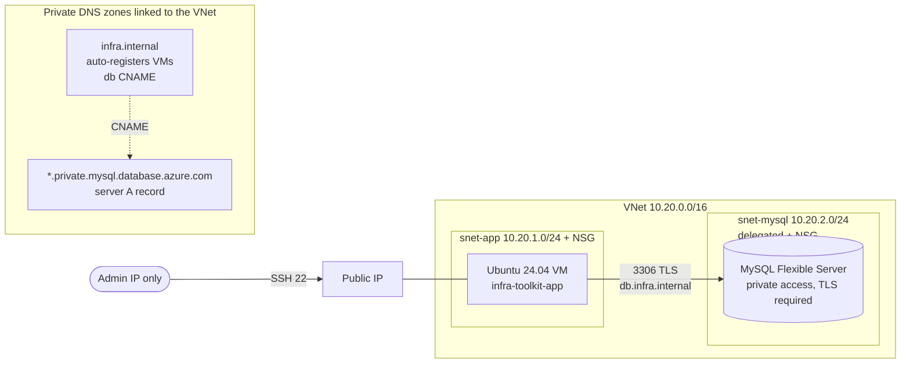

# Private VM and MySQL on Azure

A classic two-tier layout on Azure: an Ubuntu VM in an application subnet
talking to Azure Database for MySQL Flexible Server over a private network,
with name resolution handled by Azure Private DNS. The database has no public
endpoint.

Default region: `eastasia` (Hong Kong).

## Architecture



### Name resolution inside the VNet

```text
db.infra.internal
  └─ CNAME → infra-toolkit-mysql-xxxxxx.mysql.database.azure.com
       └─ CNAME → infra-toolkit-mysql-xxxxxx.infra-toolkit.private.mysql.database.azure.com
            └─ A → 10.20.2.x  (private IP in the delegated subnet)
```

Outside the VNet the same server name does not resolve to anything reachable.

## Resources

| File | Resources |
| --- | --- |
| `network.tf` | VNet, app subnet, delegated MySQL subnet, two NSGs |
| `dns.tf` | MySQL private zone, `infra.internal` zone with VM auto-registration, `db` CNAME, VNet links |
| `mysql.tf` | MySQL 8.0 Flexible Server (Burstable B1ms), `app` database, generated admin password |
| `vm.tf` | Public IP, NIC, Ubuntu 24.04 VM with SSH-key login, cloud-init, daily auto-shutdown |
| `main.tf` | Resource group and optional monthly budget |

## Network rules

| NSG | Rule | Why |
| --- | --- | --- |
| app | Allow TCP 22 from `admin_source_cidr` only | No world-open SSH; the variable has no default and rejects `0.0.0.0/0` |
| mysql | Allow TCP 3306 from `10.20.1.0/24` | Only the app tier talks to the database |
| mysql | Allow within `10.20.2.0/24` | Platform traffic inside the delegated subnet |
| mysql | Deny other `VirtualNetwork` inbound (priority 4000) | Overrides Azure's default allow-all-inside-VNet rule |

## Design decisions

**Private access (VNet integration) instead of a public server with firewall rules.**
The server gets an IP from a subnet delegated to
`Microsoft.DBforMySQL/flexibleServers` and has no public endpoint, so there is
no internet-facing attack surface to firewall in the first place.

**Two private DNS zones.**
Azure requires the server's zone to end in `.mysql.database.azure.com`. A second
zone, `infra.internal`, gives applications a stable name, `db.infra.internal`.
Replacing or restoring the server only means updating one CNAME, not every
application's configuration. The same zone auto-registers VMs, so
`infra-toolkit-app.infra.internal` follows the VM's private IP without manual
records.

**TLS is enforced, not optional.**
Flexible Server ships with `require_secure_transport=ON`; the verification
script connects with `--ssl-mode=REQUIRED` and prints the negotiated cipher.

**Cost guardrails.**
The VM shuts down daily at 23:00 Hong Kong time, and an optional resource-group
budget emails at 80% forecast and 100% actual spend.

## Cost

Both the `Standard_B2ats_v2` VM and the `B_Standard_B1ms` MySQL server are
covered by the Azure free account's 12-month allowance (750 hours a month
each). Outside that allowance the stack costs roughly US$25-35 a month, mostly
the database, so destroy it after a demo.

## Usage

Prerequisites: Terraform >= 1.11, Azure CLI, `jq`, `ssh`, `nc` and an SSH key
pair.

```bash
az login
export ARM_SUBSCRIPTION_ID="$(az account show --query id -o tsv)"

cd azure/terraform
cp terraform.tfvars.example terraform.tfvars   # set admin_source_cidr to your IP
terraform init
terraform apply

../scripts/verify_connectivity.sh
```

`verify_connectivity.sh` checks, from the real environment, that:

1. `db.infra.internal` resolves inside the VNet to a private `10.20.2.x` address
2. the VM reaches port 3306 and logs in over TLS (the password is sent over SSH
   stdin, never on a command line)
3. the server is **not** reachable from the internet

Tear down with `terraform destroy`.

## Limitations and next steps

- The MySQL admin password is generated by Terraform and therefore stored in
  state. Production would keep it in Key Vault, use Microsoft Entra
  authentication with the VM's managed identity, or use write-only arguments
  (`administrator_password_wo`).
- SSH goes to a public IP restricted by NSG. Azure Bastion or a VPN gateway
  would remove the public IP entirely, at extra cost.
- State is local for simplicity; shared use would move it to an `azurerm`
  backend in a Storage Account.
- No high availability. Zone-redundant HA needs a General Purpose or Business
  Critical SKU.
